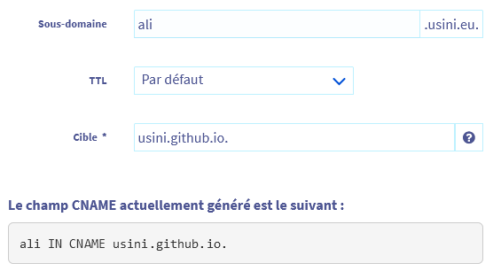

# alidirect
Redirect to Aliexpress Search   
For ex if you need an Arduino Uno, type : [ali.usini.eu/?arduino uno](http://ali.usini.eu/?arduino%20uno)    
Link are mostly not sponsored.

# Host it anywhere
* Download the file and post it on a webserver
* Or just click on index.html

# Host on your github
* Just fork this repo and modify CNAME to your subdomain,
* On your dns provider Create your own cname pointing to USERNAME.github.io

